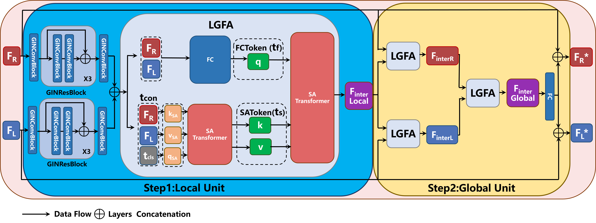
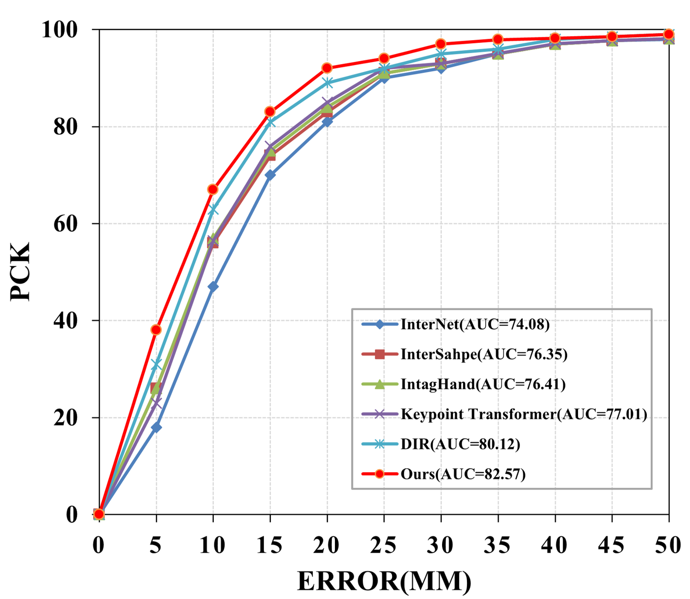
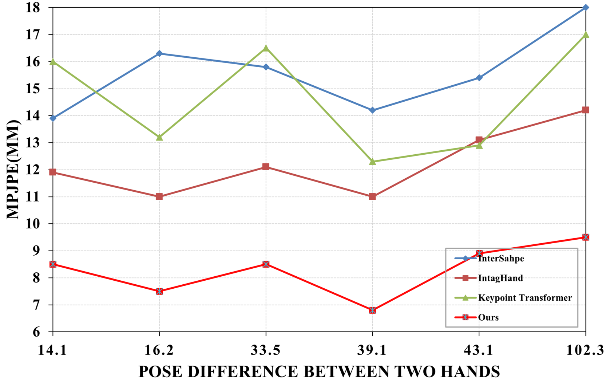

# LGNet
LGNet: Local-and-Global Feature Adaptive Network for 3D Interacting Hand Mesh Reconstruction

### Abstract
Accurate 3D interacting hand mesh reconstruction from RGB images is crucial for applications such as robotics, augmented reality (AR), and virtual reality (VR). Especially in the field of robotics, accurate interacting hand mesh reconstruction can significantly improve the accuracy and naturalness of human-robot interaction. This task requires accurate understanding of complex interactions between two hands and ensuring reasonable alignment of the hand mesh with the image. Recent Transformer-based methods directly utilise the features of the two hands as input tokens, ignoring the correlation between local and global features of the interacting hands, leading to hand ambiguity, self-obscuration and self-similarity problems.We propose LGNet, Local and Global Feature Adaptive Network, by decoupling the hand mesh reconstruction task into three stages: a joint stage for predicting hand joints; a mesh stage for predicting a rough hand mesh; and a refine stage for fine-tuning the mesh image alignment using an offset mesh.  LGNet enables high-quality fingertip-level mesh image alignment, effectively models the spatial relationship between two hands, and supports real-time prediction. Extensive quantitative and qualitative results on benchmark datasets show that LGNet outperforms state-of-the-art methods in terms of mesh accuracy and image alignment, and demonstrates strong generalisation capabilities in experiments on in-the-wild images. Our source code will be made available to the community.

### Method


**The overall architecture of Local-and-Global Feature Adaptive Network (LGNet).**

**The joint stage** aims to extract hand features (**F_R** or **F_L**) from the input image, fuse them into global interaction features, and adapt them to each hand (**F_R*** or **F_L***). Subsequently, the joint feature extractor derives the predicted 2.5D joint coordinates (**J_R** or **J_L**) and joint features (**F_JR** or **F_JL**) for each hand from the adapted features (**F_R*** or **F_L***).

**The mesh stage** feeds the augmented joint features (**F_JR*** or **F_JL***) to the regressor for recovering the rough 3D hand mesh (**V_R** or **V_L**).

**The refine stage** fuses the image features, local interaction features, and global interaction features from the joint stage and passes them to the graph convolutional layer (GCN) to regress the offset mesh **ΔM** and generate the final hand mesh **M_f = M_r + ΔM**.



**The overall architecture of Local-and-Global Feature Adaptive Block (LGBlock).**  
**Step 1.** Local unit for hand local interaction feature extraction. Local interaction features **F_inter^local** are extracted by fusing two hand features (**F_R** and **F_L**).  
**Step 2.** Global unit for global interaction feature adaptation. The global interaction feature **F_inter^global** is obtained by fusing the local interaction feature (**F_interR** and **F_interL**) and adapted to each hand.


<div style="text-align: center;">
    
</div>

**Visualization of attention maps in pseudo color.** Ten independent examples are shown. In each example, from left to right is the input image, local stage attention map overlaid on the image, and global stage attention map. For the local stage attention map, red represents attention from the right hand, and blue represents attention from the left hand. Brighter colors indicate stronger attention. For the global attention map, brighter colors indicate stronger cross-hand attention. All attention maps have been normalized for better visualization.



**Comparison with SOTA methods on InterHand2.6M.**



**Robustness to asymmetric poses of two hands on InterHand2.6M.**

<div style="display: flex; justify-content: center;">
    
    
</div>

#### Getting started

- Clone this repo.
```bash
git clone https://github.com/HaoWeiHsueh/LGNet
cd LGNet/main
```

- Install dependencies. (Python 3 + NVIDIA GPU + CUDA. Recommend to use Anaconda)
```bash
pip install -r requirements.txt
```

- Prepare the training and testing dataset. (https://mks0601.github.io/InterHand2.6M/)
